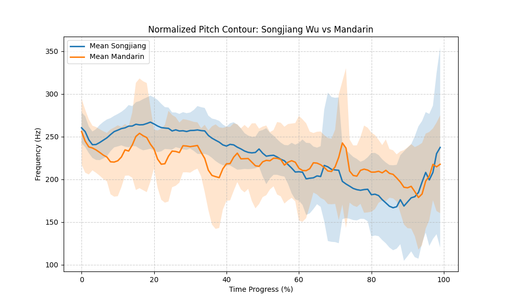
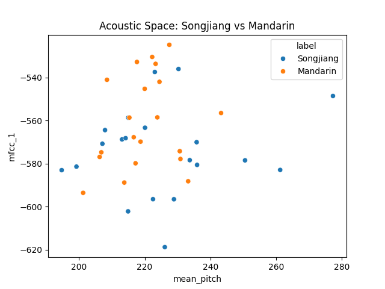

# Acoustic Analysis: Songjiang Wu vs. Standard Mandarin
> **Project Type**: Comparative Phonetics
> 
> **Author**: SenAkiShimo（千落霜子/Yang Yang）

## 1. Project Overview
This project performs an automated acoustic comparison between **Songjiang Wu (松江话)** and **Standard Mandarin (普通话)**.
Using Python, I analyzed a single-speaker dataset of 20 parallel sentences to identify differences in pitch, duration, and timbre.

---

## 2. Methodology
To ensure scientific accuracy, the following steps were taken:
- **Audio Prep**: Recorded 40 samples (20 per language) at 44100Hz/24-bit/mono.
- **Normalization**: Applied **Time-Normalization** to pitch contours (interpolated to 100 points) to compare intonation patterns regardless of sentence length.
- **Feature Extraction**: 
  - **Pitch (F0)**: Extracted via `parselmouth`.
  - **Timbre**: Extracted 13-dimensional **MFCCs** via `librosa`.
  - **Temporal**: Measured sentence duration in seconds.

---

## 3. Results & Visualization
### A. Normalized Pitch Contours

**Key Observation**: 
- Mandarin's F0 trajectory is relatively flat (175–250 Hz range), while Songjiang Wu displays greater tonal fluctuation (150–275 Hz range). The Songjiang dialect defines the overall pitch envelope of the dataset, recording both the peak and the trough of the averaged contours.
- While Songjiang Wu exhibits a significant dip in mean pitch around the 80% mark, Standard Mandarin maintains a steady and gradual decrease throughout.

### B. Acoustic Space

**Key Observation**: 
- The plot illustrates that MFCC_1* values for Songjiang Wu are consistently lower than those of Mandarin across all mean pitch regions. While Mandarin generally exhibits higher MFCC values, Songjiang Wu shows significantly greater variance in mean pitch, accounting for both the absolute minimum and maximum values in this dataset.

> **Note**: Since MFCC_1 is often related to the overall spectral energy or the "fullness" of the voice, mentioning it is lower in Songjiang might relate to the breathy or voiced qualities often found in Wu dialects.

### C. Statistical Summary

| Feature | Songjiang (Avg) | Mandarin (Avg) |
| :--- | :--- | :--- |
| Mean Pitch (Hz) | 225.58 | 220.08 |
| Pitch Range(Hz) | 203.55 | 241.11 |
| Duration (s) | 1.72 | 2.09 |
| mfcc_1 | -574.27 | -560.77 |

- **Mean Pitch (Songjiang)**: 225.58 Hz
- **Mean Pitch (Mandarin)**: 220.08 Hz
- **P-value（Independent Samples T-Test）**:0.28*（this P-value should not be considered, since same person recorded all smaples）
- **P-value（Paired Samples T-Test）**: 0.2432*

> **Note**: A P-value < 0.05 indicates a statistically significant difference.

---

## 4. Conclusion

The mean duration of Songjiang Wu sentences was 1.72s, while Mandarin was 2.09s. A paired t-test yielded a p-value of 0.2432 for duration, indicating no statistically significant difference in overall speech rate between the two languages for this specific speaker and dataset.

Similarly, the overall pitch register is highly similar (P = 0.2432), suggesting that the perceived difference between Songjiang Wu and Mandarin lies in dynamic tone contours (shape) and timbre (MFCC) rather than a simple shift in average pitch.

Therefore, although the mean pitch difference is not statistically significant, the normalized pitch contours reveal that this is primarily due to the high variance and wide pitch range of Songjiang Wu (150Hz–275Hz). The dialect's acoustic identity is defined by its tonal volatility (extreme highs and lows) rather than a shift in the average frequency register.
